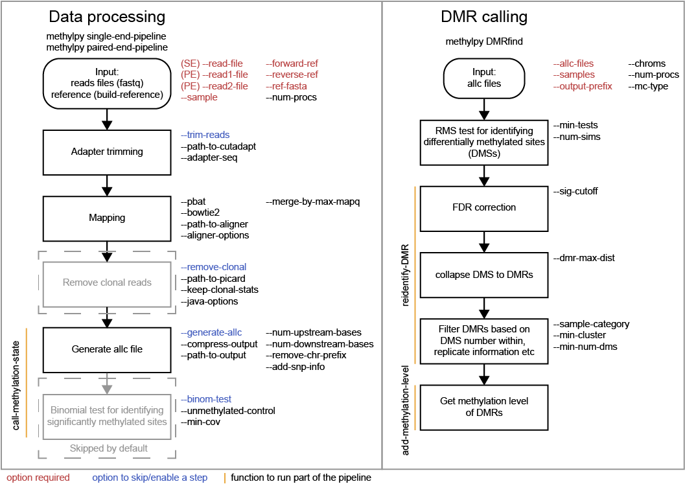
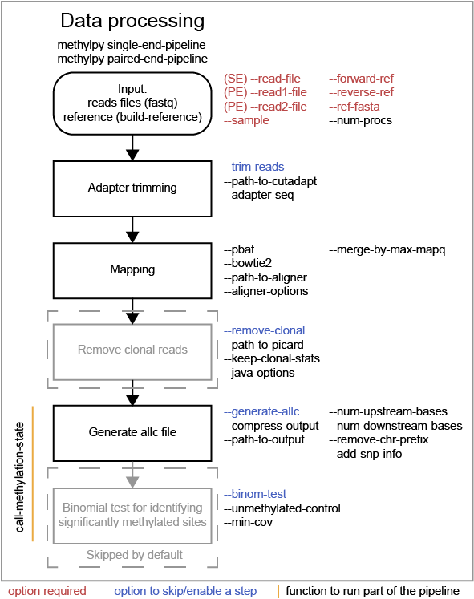
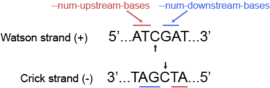
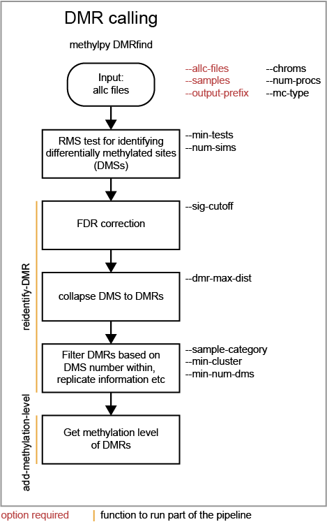

# methylpy Tutorial (beta version)
methylpy is an analysis pipeline for DNA methylation data. It is used for analyzing bisulfite 
sequencing (BS-seq) data and NOMe-seq (Nucleosome Occupancy and Methylome Sequencing) data. 
The analysis includes two major tasks, both of which can be fully conducted using methylpy: 

* Data processing (from raw reads to methylation level)
* Differential methylation analysis

This tutorial will cover how to use methylpy to conveniently accomplish such tasks.
This document is divided into six sections. It starts with a quick overview of major functions and
commands in methylpy. Second section is about the installation of methylpy and its dependencies.
Next section describes how to use methylpy to process bisulfite sequencing data or NOMe-seq data 
starting from raw reads or aligned reads. methylpy is also capable of performing differential methylation
analysis to delineate differentially methylated regions (DMRs), which will be elaborated in the
fourth section. The fifth part of this tutorial shows the commands for manipulating processed files
from methylpy (in allc format), including merging, filtering, indexing allc files, and converting
allc format into bigwig format as well as getting the methylation level of a set of genomic regions.
The last part includes several useful tips for analyzing methylation data.

# Table of Contents
* [Getting started](#getting-started)
* [Installation](#installation)
* [Overview](#overview)
* [Data Processing](#data-processing)
* [DMR Calling](#dmr-calling)
* [allc File Manipulation](#allc-file-manipulation)
* [Tips of using methylpy](#tips-of-using-methylpy)

# Getting started
#### methylpy installation
methylpy can be easily installed through `pip`.
```
pip install methylpy
```
methylpy depends on two python modules, numpy and scipy, which are easily installed through anaconda.
Other dependencies include bowtie/bowtie2, cutadapt, samtools, picard and wigToBigWig.
See [Installation](#installation) section for details.

methylpy contains several functions serving distinct needs. If methylpy is installed, `methylpy -h`
gets the list of all the functions.

#### A typical analysis protocol
Aanalysis for DNA methylation data (NOMe-seq data) typically includes three steps: 

* Building reference,
* Data processing
* DMR calling

We will run through a real world example to show how methylpy can be used to
accomplish these tasks. Running the example will take around 6h. 
Also, we will need a server/computer with at least 8 processors,around 100g free
space on its hard drive and at least 4g memeory. 

#### Example description
In the example task, we want to identify genomic regions that display differential CG methylation
between two distinct structures in Arabidopsis root (lower columella and cortex). We will use methylpy to
analyze the whole-genome BS-seq data of these two structures from 
[Kawakatsu et al](https://www.nature.com/articles/nplants201658). Although it is an example of analyzing
Arabidopsis methylome, same procedure can be applied to study methylomes of other organisms such as  mammals.

#### Downloading data
We first download the BS-seq raw reads of cortex and lower columella as well as Tair10 arabidopsis
reference genome.
```
wget http://neomorph.salk.edu/yupeng/share/methylpy_example.tar.gz
tar -xf methylpy_example.tar.gz
cd methylpy_example	
```
In the following text, we will go through the analysis process step by step using methylpy.
If you would like to run the entire analysis procedure directly, simply type `sh run_example.sh`.

#### Building reference
Once we have the data, the first step is to build converted reference genome using `build-reference` function
in methylpy (which takes around 5 minitues).
```
methylpy build-reference \
	--input-files genome/tair10.fa \
	--output-prefix genome/tair10 \
	--bowtie2 True \
	--parallel True
```
The command will generate bowtie/bowtie2 index files of forward converted reference
(`genome/tair10_f`) and that of reverse conveted reference (`genome/tair10_r`).
The reference genome is essential for the mapping step in BS-seq data processing.

#### Processing BS-seq data
Next, we will map raw BS-seq reads of lower columella and cortex samples to the reference built in last step, 
and obtain methylation level (also called as methylation ratio/frequency) of each cytosine in the genome.
We first process the data of cortex using command:
```
methylpy single-end-pipeline \
	--read-files raw_reads/cortex.fastq.gz  \
	--sample cortex \
	--forward-ref genome/tair10_f \
	--reverse-ref genome/tair10_r \
	--ref-fasta genome/tair10.fa \
	--num-procs 8 \
	--compress-output False \
	--path-to-output results/
```
Then, we run similar command to process the data of lower columella:
```
methylpy single-end-pipeline \
	--read-files raw_reads/lower_columella.fastq.gz \
	--sample lower_columella \
	--forward-ref genome/tair10_f \
	--reverse-ref genome/tair10_r \
	--ref-fasta genome/tair10.fa \
	--num-procs 8 \
	--compress-output False \
	--path-to-output results/
```
Processing cortex and lower columella data takes around 2.5 hours and 2 hours repectively.
When the data processing is finished, we will get several output files in the `results/` directory. 
Among them, `results/allc_cortex.tsv` and `results/allc_lower_columella.tsv` store the methylation information
of every cytosine (C) in the two samples. The two files are in [allc](#output-format) format.

#### Finding DMRs
Remember our task is to compare the CG methylation patterns between cortex and lower columella. 
With the allc files at hand, we can finally begin to identify DMRs, the genomic regions showing differential methylation.
```
methylpy DMRfind \
	--allc-files results/allc_cortex.tsv \
		         results/allc_lower_columella.tsv \
	--samples cortex lower_columella \
	--mc-type "CGN" \
	--chroms 1 2 3 4 5 \
	--num-procs 8 \
	--min-num-dms 5 \
	--output-prefix results/CG_DMR_CX_LC
```
The DMRs are stored in `results/CG_DMR_CX_LC_rms_results_collapsed.tsv` and
`results/CG_DMR_CX_LC_rms_results_collapsed.tsv.DMR.bed`. The former includes details about each DMRs and
the later file is in BED format, which can be visualized in genome browser. Another file
`results/CG_DMR_CX_LC_rms_results_collapsed.tsv.DMS.bed` indicates the location of all DMSs (differentially
methylated sites).

#### Visualizing methylation data and DMRs
To visualize the results, we first converted allc file to bigWig file using the `allc-to-bigwig` function
because bigWig format is widely supported by genome browsers. 
```
methylpy allc-to-bigwig \
	--allc-file results/allc_cortex.tsv \
	--output-file results/mCG_cortex.bw \
	--ref-fasta genome/tair10.fa \
	--bin-size 1 \
	--min-cov 3 \
	--add-chr-prefix True
```
```
methylpy allc-to-bigwig \
	--allc-file results/allc_lower_columella.tsv \
	--output-file results/mCG_lower_columella.bw \
	--ref-fasta genome/tair10.fa \
	--bin-size 1 \
	--min-cov 3 \
	--add-chr-prefix True
```
Once the conversion, we can readily upload
`results/mCG_cortex.bw`, `mCG_lower_columella.bw`,
`results/CG_DMR_CX_LC_rms_results_collapsed.tsv.DMS.bed` and
`results/CG_DMR_CX_LC_rms_results_collapsed.tsv.DMR.bed` to genome browser such as
[IGV](http://software.broadinstitute.org/software/igv/) for visualization.

# Installation
#### Step 1 - Downloading methylpy
methylpy supports macOS and Linux operating system. The easiest way to install
methylpy is through PyPI by running
```
pip install methylpy
```
To update methylpy, run
```
pip install --upgrade methylpy
```
methylpy can be alternatively installed through github:
```
git clone https://github.com/yupenghe/methylpy.git
cd methylpy/
python setup.py install
```
If you would like to install methylpy in path of your choice, run 
`python setup.py install --prefix=/USER/PATH/`. 
Then, try `methylpy` and if no error pops out, the setup is likely successful.
See [Testing methylpy](#testing-methylpy) for more rigorious test.

#### Step 2 - Installing dependencies
methylpy is written in python so python2/3 is needed. python2/3 can be installed though
[anaconda](https://www.anaconda.com/download/). methylpy also depends on two python modules,
[numpy](http://www.numpy.org/) and [scipy](https://www.scipy.org/). These two modules are
automatically installed if you use anaconda.

In addition, some features of methylpy also depend on several publicly available tools.
* [cutadapt](http://cutadapt.readthedocs.io/en/stable/installation.html) (>=1.9) for raw read trimming
* [bowtie](http://bowtie-bio.sourceforge.net/index.shtml) and/or 
[bowtie2](http://bowtie-bio.sourceforge.net/bowtie2/index.shtml) for alignment
* [samtools](https://github.com/samtools/samtools) (>=1.3) for alignment results manipulation
* [Picard](https://broadinstitute.github.io/picard/index.html) (>=2.10.8) for removal of PCR duplicates
* java (its path included in `PATH` environment variable) for running Picard
* [wigToBigWig](http://hgdownload.soe.ucsc.edu/admin/exe/linux.x86_64/wigToBigWig) for converting methylpy output 
to bigwig format

Lastly, if paths to cutadapt, bowtie/bowtie2, samtools and wigToBigWig are included in `PATH` variable,
methylpy is able to find these tools. Otherwise, the paths have to be passed to methylpy as augments.
The path to picard.jar needs to be passed to methylpy as a parameter to run PCR duplicate removal.

#### (optional) Compiling rms.cpp
DMR finding requires an executable `/YOUR/PATH/methylpy/run_rms_tests.out`. It was a precompiled binary of
C++ code `/YOUR/PATH/methylpy/rms.cpp`. In most cases, the precompiled file can be executed directly. To
test this, simply run execute `/YOUR/PATH/methylpy/run_rms_tests.out`. If help information is printed, 
recompiling is not needed. However, if error turns up, it means that the executable needs to be
regenerated by compiling `rms.cpp` and this step requires [GSL](https://www.gnu.org/software/gsl/).
In most linux operating system, the below commands will do the job
```
cd /YOUR/PATH/methylpy/
g++ -O3 -l gsl -l gslcblas -o run_rms_tests.out rms.cpp
```
In Ubuntu (>=16.04), please try the below commands first.
```
cd /YOUR/PATH/methylpy/
g++ -o run_rms_tests.out rms.cpp `gsl-config --cflags —libs`
```

Lastly, the compiled file `run_rms_tests.out` needs to be copied to the
directory where methylpy is installed. You can get the directory by running
the blow commands in python console (`python` to open a python console):
```
import methylpy
print(methylpy.__file__[:methylpy.__file__.rfind("/")]+"/")
```

#### Setting up directory for temporary files
Processing large dataset will require large spare space for temporary files.
Usually, the default directory for temporary files will not meet the need.
You may want to set the `TMPDIR` environmental variable to the (absolute) path of a directory
on hard drive with sufficient space (e.g. `/YOUR/TMP/DIR/`). This can be done by adding the 
below command to `~/.bashrc file`: `export TMPDIR=/YOUR/TMP/DIR/` and run `source ~/.bashrc`.

#### Testing methylpy
To test whether methylpy and the dependencies are installed and set up correctly, run
```
wget http://neomorph.salk.edu/yupeng/share/methylpy_test.tar.gz
tar -xf methylpy_test.tar.gz
cd methylpy_test/
python run_test.py
```
The test should take around 3 minutes, and progress will be printed on screen. After the test is
started, two files `test_output_msg.txt` and `test_error_msg.txt` will be generated. The former
contains more details about each test and the later stores error message (if any) as well as additional
information.

If test fails, please check `test_error_msg.txt` for the error message. If you decide to submit an issue
regarding test failure to methylpy github page, please include the error message in this file.

# Overview
methylpy is designed mainly to 1) obtain the methylation state of each cytosine in genome from sequencing reads, 
and 2) identify genomic regions/sites that are differentially methylated. We call first task data processing
and the second task differentially methylated region (DMR) calling. Below figure is an overview of the methylpy
workflow for these two tasks as well as the key functions and parameters. Details will be described in following
sections.




# Data Processing
Data Processing takes raw reads as input, maps them to reference genome and reports the methylation
state of each cytosine in the genome. This procedure includes several steps: 1) adapter trimming
using cutadapt, 2) aligning reads to 
reference genome using bowtie/bowtie2, 3) removing clonal reads using Picard, 4) generating 
allc file, and 5) performing binomial test to identify cytosines that are significantly methylated
compared to noise due to bisulfite non-conversion. Among these steps, 3) removal of clonal reads will
not be run by default option but it is highly recommended.



#### build-reference
Data processing requires pre-built converted reference. The `methylpy build-reference` can be used 
To get the pre-built reference. The function takes the genome sequence 
([FASTA](https://en.wikipedia.org/wiki/FASTA_format) format) as input,
performs in silico convertion (C->T for forward reference, and G->A for reverse reference), and 
indexes the converted genome using bowtie or bowtie 2.
Below is an example of building reference for mm10 mouse genome:
```
methylpy build-reference \
	--input-files mm10/mm10.fa \
	--output-prefix mm10/mm10 \
	--bowtie2 True
```
`mm10/mm10.fa` is a FASTA file containing the sequence of mouse genome (mm10).
Run `methylpy build-reference -h` to get more information about all options available.

#### Processing single-end data
`single-end-pipeline` function is for processing single-end BS-seq/NOMe-seq data. It has five required parameters

* `--read-files` space seperated compressed (.gz) and/or uncompressed fastq files
* `--sample` sample name
* `--forward-ref` the prefix of forward reference (the output prefix when run `build-reference` concatenated with "_f" (e.g. `mm10/mm10_f`)
* `--reverse-ref` the prefix of revesred reference (e.g. `mm10/mm10_r`)
* `--ref-fasta` genome fasta file

Other commonly used parameters are 

* `--num-procs` for using multiple processors
* `--remove-clonal` whether to run Picard to remove PCR duplicates. This should be coupled with `--path-to-picard`, which specifies path of `picard.jar`.
* `--pbat` for processing data from PBAT (post-bisulfite adapter tagging) library
* `--num-upstream-bases` for including base(s) upstream cytosine in the sequence context (see [BS-seq versus NOMe-seq](#BS-seq-versus-NOMe-seq) for details)
* `--generate-allc-file` for skipping allc generation making this function solely for doing alignment
* `--compress-output` whether to compress output allc filed
* `--trim-reads` whether to run cutadapt to remove adapter and low-quality bases near read ends
* `--merge-by-max-mapq` whether to keep reads that can be aligned to both forward and reverse reference if one alignment is better than the other. This is useful for genome with low complexity (e.g. genome with many repeats).

An example of running `single-end-pipeline`:
```
methylpy single-end-pipeline \
	--read-files raw_reads/cortex.fastq.gz  \
	--sample cortex \
	--forward-ref genome/tair10_f \
	--reverse-ref genome/tair10_r \
	--ref-fasta genome/tair10.fa \
	--num-procs 8 \
	--compress-output False \
	--path-to-output results/
```

#### Processing paired-end data
The function `paired-end-pipeline` is for processing paired-end BS-seq/NOMe-seq data.
Parameters of `paired-end-pipeline` are almost identical to those of `single-end-pipeline`.
One of the only two differences is that `--read-files` option in 
`single-end-pipeline` is replaced by `--read1-files` and `--read2-files`, which take fastq files of read 1
and read 2 as input respectively. Note that the list of read 1 fastq files needs to match read 2 fastq files
such that read 1 and read 2 are correctly paired. The other parameter difference is that `--adapter-seq` becomes
`--adapter-seq-read1` and `--adapter-seq-read2`.

Required options for `paired-end-pipeline`:

* `--read1-files` space seperated compressed (.gz) and/or uncompressed fastq files of read 1
* `--read2-files` space seperated compressed (.gz) and/or uncompressed fastq files of read 2
* `--sample` sample name
* `--forward-ref` the prefix of forward reference (the output prefix when run `build-reference` concatenated with "_f" (e.g. `mm10/mm10_f`)
* `--reverse-ref` the prefix of revesred reference (e.g. `mm10/mm10_r`)
* `--ref-fasta` genome fasta file

#### Output format
The output files from either pipeline are one [BAM](https://samtools.github.io/hts-specs/SAMv1.pdf) and 
a (compressed) tab-separated text file in allc format. "allc" stands
for all cytosines (C). Each row in an allc file corresponds to one cytosine in the genome. 
An allc file contain 7 mandatory columns and no header. Two additional columns may be added
with `--add-snp-info` option when using `single-end-pipeline`, `paired-end-pipeline` or
`call-methylation-state` methods. 

|index|column name|example|note|
|:----:|:-----:|:-----:|:---:|
|1|chromosome|12|with no "chr"|
|2|position|18283342|1-based|
|3|strand|+|either + or -|
|4|sequence context|CGT|can be more than 3 bases|
|5|mc|18|count of reads supporting methylation|
|6|cov|21|read coverage|
|7|methylated|1|indicator of significant methylation (1 if no test is performed)|
|8|(optional) num\_matches|3,2,3|number of match basecalls at context nucleotides|
|9|(optional) num\_mismatches|0,1,0|number of mismatches at context nucleotides|

#### call-methylation-state
The `call-methylation-state` function allows users to get cytosine methylation state (allc file) from
alignment file (BAM file).
It is part of the data processing pipeline which is especially useful for getting the allc file from
alignment file from other methylation data pipelines like bismark. Run `methylpy call-methylation-state -h`
to get help information. Below is an example of running this function. Please make sure to remove 
`--paired-end True` or use `--paired-end False` for BAM file from single-end data.

```
methylpy call-methylation-state \
	--input-file mESC_processed_reads_no_clonal.bam \
	--paired-end True \
	--sample mESC \
	--ref-fasta mm10_bt2/mm10.fa \
	--num-procs 8
```

#### BS-seq versus NOMe-seq
methylpy is also able to proccess data from NOMe-seq assay, in which GpC methyltransferase M.CviPI is added
to methylated GC sites that are within open chromatin. Therefore, we need to separate GC sites from other
cytosines in the analysis. As we know CG sites are often highly methylated, methylation at GCG sites are
ambiguous and need to be excluded in analysis. In this assay, methylation at GCH sites (open chromatin;
H = A, C and T), HCG sites (CG methylation) and HCH sites (CH methylation) have very different biological implication.
To distinguish cytosines at different sequence contexts, we need to include the upstream (5') one base when investigating
each cytosine. Therefore, we specify `--num-upstream-bases` to 1 for processing NOMe-seq data.



# DMR calling
DMR calling is to identify the genomic regions that show statistically significant different methylation state in
different samples. Multiple allc files are the input. First, methylpy performs statistic test to identify differentially
methylated sites (DMSs). Then, it merges DMSs into blocks, or differentially methylated regions (DMRs).



#### DMRfind
`DMRfind` is the core function for performing DMR calling. This function has three required options

* `--allc-files` a list of  allc files (space separated)
* `--samples` a list of samples (space separated)
* `--output-prefix` output prefix

Other important options include

* `--num-procs` number of processors
* `--chroms` chromosomes (space separated) where DMR calling will be performed
* `--mc-type` contexts for sites to be included (e.g. CGN for DMR calling for CG methylation)
* `--sample-category` space-separated sample group names for specifying which samples are considered as replicates
* `--min-cluster` minimum number of samples that are from the same category and called as hypo-/hyper- for DMRs to be reported
* `--mc-max-dist` distance for merging data of adjacent sites to boost DMR calling sensitivity
* `--dmr-max-dist` distance for merging DMSs into DMRs
* `--min-num-dms` minimum number of DMSs required in DMRs

Help information of this function is available via `methylpy DMRfind -h`. 

Below is the code of an example of calling DMRs for CG methylation between two samples, 
`AD_HT` and `AD_IT` on chromosome 1 through 5 using 8 processors.
```
methylpy DMRfind \
	--allc-files allc/allc_AD_HT.tsv.gz allc/allc_AD_IT.tsv.gz \
	--samples AD_HT AD_IT \
	--mc-type "CGN" \
	--chroms 1 2 3 4 5 \
	--num-procs 8 \
	--output-prefix DMR_HT_IT
```

#### reidentify-DMR
methylpy is able to reidentify-DMR based on the result of previous DMRfind run. This function is especially
useful in picking out DMRs across a subset of categories and/or with different filters. 
See `methylpy reidentify-DMR -h` for details about the options.
```
methylpy reidentify-DMR \
	--input-rms-file results/DMR_P0_FBvsHT_rms_results.tsv.gz \
	--output-file results/DMR_P0_FBvsHT_rms_results_recollapsed.tsv \
	--collapse-samples P0_FB_1 P0_FB_2 P0_HT_1 P0_HT_2 \
	--sample-category P0_FB P0_FB P0_HT P0_HT \
	--min-cluster 2
```

# allc file manipulation
#### allc-to-bigwig
The `allc-to-bigwig` function generates bigwig file from allc file. Methylation level will be
calculated in equally divided non-overlapping genomic bins and the output will be stored in a bigwig
file. See `methylpy allc-to-bigwig -h` for more information. 
```
methylpy allc-to-bigwig \
	--allc-file results/allc_mESC.tsv.gz \
	--output-file results/allc_mESC.bw \
	--ref-fasta mm10_bt2/mm10.fa \
	--mc-type CGN \
	--bin-size 100 	
```

#### merge-allc
Merge multiple allc files by adding up methylation readcount (mc) and coverage (h).
The `merge-allc` function can merge multiple allc files into a single allc file. It is useful when 
separate allc files are generated for replicates of a tissue or cell type, and one wants to get a single
allc file for that tissue/cell type. See `methylpy merge-allc -h` for more information. 
```
methylpy merge-allc \
	--allc-files allc/allc_AD_HT_1.tsv.gz allc/allc_AD_HT_2.tsv.gz \
	--output-file allc/allc_AD_HT.tsv.gz \
	--num-procs 1 \
	--compress-output True
```

#### filter-allc
The `filter-allc` function is for filtering sites by cytosine context, coverage etc. 
See `methylpy filter-allc -h` for more information. 
```
methylpy filter-allc \
	--allc-file allc/allc_AD_HT_1.tsv.gz \
	--output-file allc/allCG_AD_HT_1.tsv.gz \
	--mc-type CGN \
	--min-cov 2 \
	--compress-output True
```

#### index-allc
The `index-allc` function allows creating index file for each allc file. The index file can be used for
speeding up allc file reading similar to the .fai file for .fasta file. See `methylpy index-allc -h` 
for more information. 
```
methylpy index-allc \
	--allc-files allc/allc_AD_HT_1.tsv.gz allc/allc_AD_HT_2.tsv.gz \
	--num-procs 2 \
	--no-reindex False
```


# Miscellaneous
#### add-methylation-level
Calculating methylation level of certain genomic regions can give an estimate of the methylation
abundance of these loci. This can be achieved using the `add-methylation-level` function. 
See `methylpy add-methylation-level -h` for more details about the input format and available options.
```
methylpy add-methylation-level \
	--input-tsv-file DMR_AD_IT.tsv \
	--output-file DMR_AD_IT_with_level.tsv \
	--allc-files allc/allc_AD_HT_1.tsv.gz allc/allc_AD_HT_2.tsv.gz \
		allc/allc_AD_IT_1.tsv.gz allc/allc_AD_IT_2.tsv.gz \
	--samples AD_HT_1 AD_HT_2 AD_IT_1 AD_IT_2 \
	--mc-type CGN \
	--num-procs 4
```

#### bam-quality-filter
Sometimes, we want to filter out reads that cannot be mapped confidently or are likely from 
under-converted DNA fragments. This can be done using the `bam-quality-filter` function.
See `methylpy bam-quality-filter -h` for parameter inforamtion. 

For example, below command can be used to filter out reads with less than 30 MAPQ score
(poor alignment) and with mCH level greater than 0.7 (under-conversion) if the reads contain
enough (at least 3) CH sites.

```
methylpy bam-quality-filter \
	--input-file mESC_processed_reads_no_clonal.bam \
	--output-file mESC_processed_reads_no_clonal.filtered.bam \
	--ref-fasta mm10_bt2/mm10.fa \
	--min-mapq 30 \
	--min-num-ch 3 \
	--max-mch-level 0.7 \
	--buffer-line-number 100
```

### Tips for using methylpy

* Hard drive space and memory requirement: Hard drive space usually space that is three times of the size of all uncompressed fastq files is enough for running the pipeline. 
* Memory: methylpy is memory efficient but the sort function (from linux system) could potentially occupy memory. This can be control by the `--sort-mem` option (see below). For example, if a node has 24G memory and 16 CPUs, the `--sort-mem` option should be set to be `1G` if all 16 CPUs are used. In that case, methylpy will take a most 16 * 1G = 16G memory. Please set the value of sort_mem according to the capacity of your computer/cluster.
